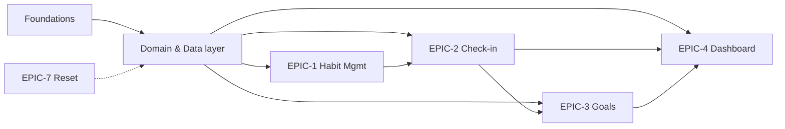
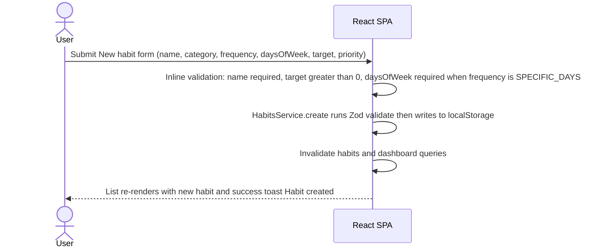
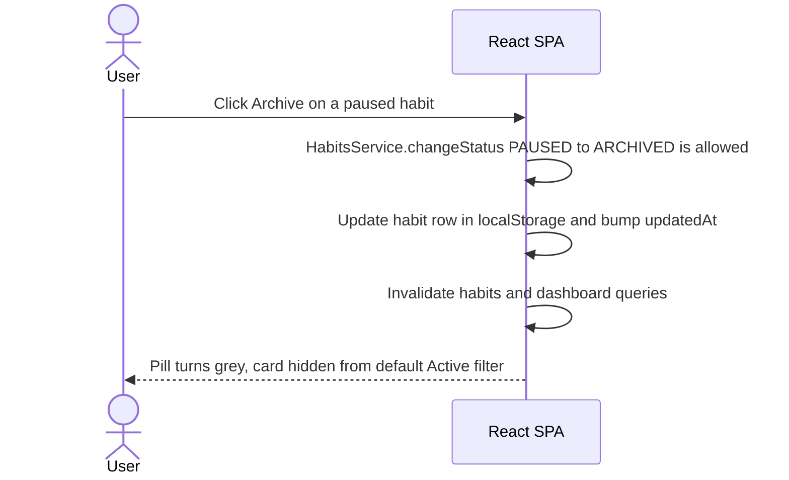
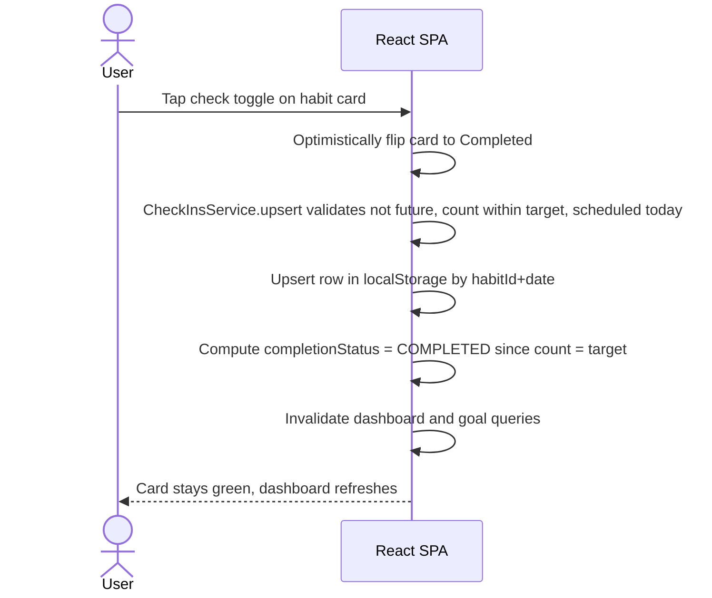
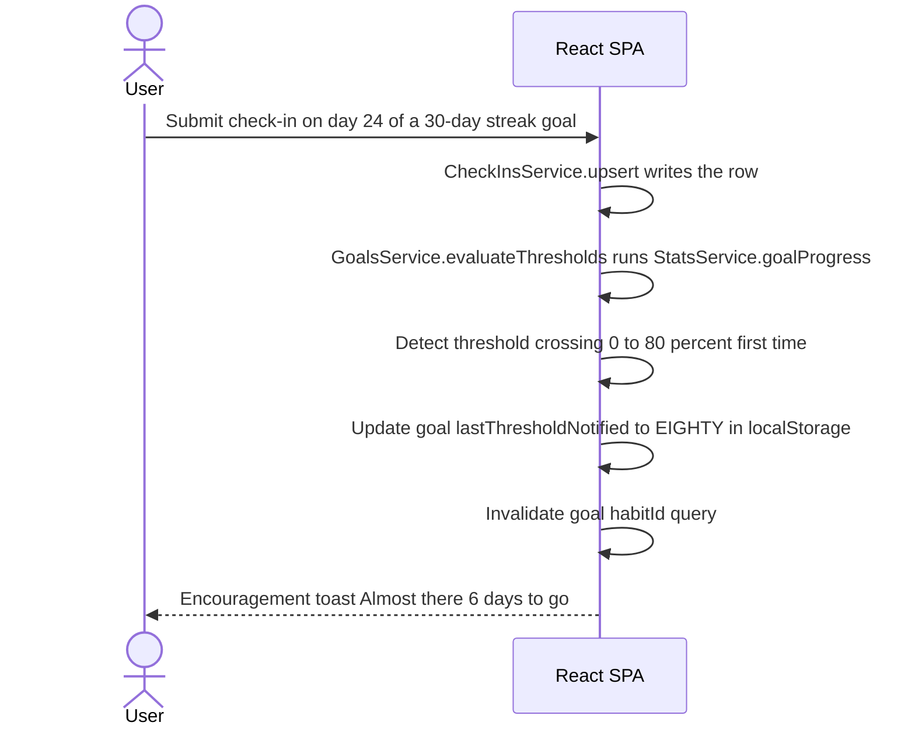
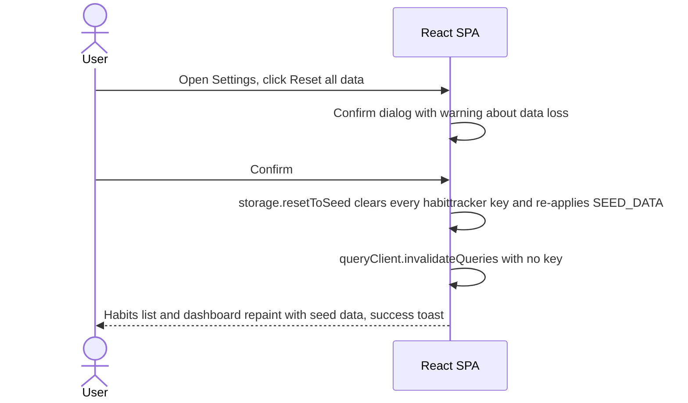
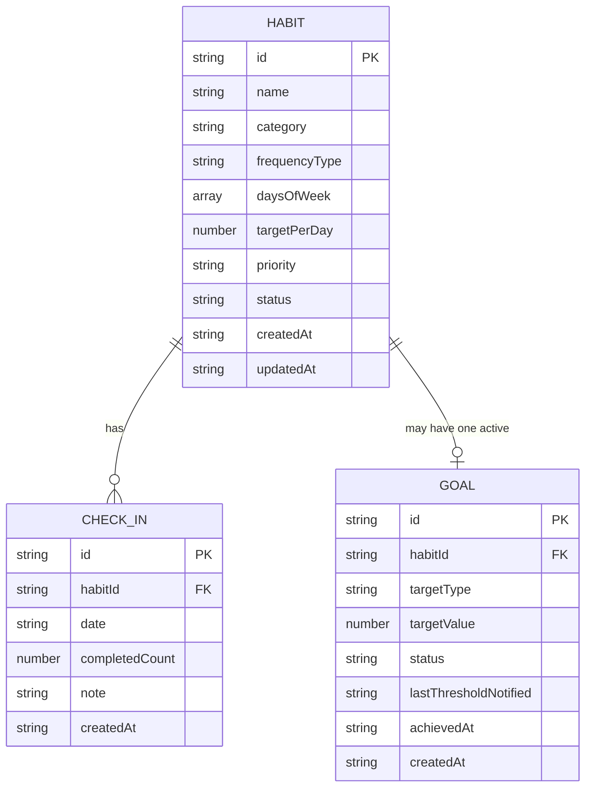

# Habit Tracker Pro — 1.5-Week Lean BA Breakdown (FE-only · Wecamp Brief-aligned)

> Brief-aligned, frontend-only plan for a 7-student team to deliver **every Core feature and Mandatory Advanced challenge** from the Wecamp Batch 11 capstone brief in **7–8 working days**, using only **React + TypeScript + localStorage** as the brief mandates.

---

## 1. Document Control

| Field           | Value                                                                                                |
| --------------- | ---------------------------------------------------------------------------------------------------- |
| Document Title  | Habit Tracker Pro — 1.5-Week Lean BA Breakdown                                                       |
| Version         | 2.0 (FE-only — backend layer dropped after team discussion)                                          |
| Status          | Draft for engineering review                                                                         |
| Author          | Business Analyst - Liara Nguyen                                                                      |
| Source brief    | [`Wecamp 11 - Capstone Project.pdf`](./Wecamp%2011%20-%20Capstone%20Project.pdf) by Pinky Huy Le     |
| Date            | 2026-06-06                                                                                           |
| Audience        | 7-person student team (all working on the same React codebase); Tutor / Reviewer; Wecamp judge panel |
| Delivery window | **1.5 weeks · 7–8 working days · ~60 person-pts of capacity (4 × 15 pts)**                           |
| Stack           | **Vite + React 18 + TypeScript (strict) + Tailwind 3 + TanStack Query v5 + localStorage**            |

### 1.1 How to read this document

- §2 explains what the brief mandates and how this lean doc covers every Core + Advanced item — see the _brief-coverage matrix_ in §2.4.
- §3 is the lean Epic Map (foundations, 4 functional epics, UX & Error Handling, Reset).
- §4 has **one** cross-layer Mermaid diagram per epic (5 total). All diagrams are 2-actor (`User → SPA`) because there is no backend.
- §5 = Frontend user stories (`FE-US-01` … `FE-US-23`, **23** stories).
- §6–8 are build references (lean local data interface, lean data model, lean tech stack).
- §9 has 5 NFRs.
- §10–11 govern delivery (DoD with the 6-item UX checklist, 1.5-week roadmap).
- §12 is the _scope-cut audit_ — every full-doc story we deferred mapped to its full-doc ID.
- §13 is the demo script (the 12-step linear walkthrough that exercises every brief requirement live).

### 1.2 Visual companion — UI mockups

For the visual contract that every story implements, open the clickable Tailwind prototype:

- **[`mockups/index.html`](./mockups/index.html)** — single-file HTML, no build step (Tailwind via CDN). 12 annotated screens covering every PRP, including state variants (empty / loading / error / 80 % / 100 % / archived / etc.).
- **[`mockups/README.md`](./mockups/README.md)** — design tokens (canonical Tailwind classes) the team should copy into `frontend/src/` verbatim.

If a PRP's AC and the prototype disagree, the PRP wins — update the prototype in the same PR.

---

## 2. Brief alignment

### 2.1 Why this version exists

After a team discussion the team has **dropped the backend layer entirely** and is aligning with the Wecamp brief's explicit mandate: _"Use React for the frontend. You may use localStorage or a mocked JSON file for data persistence. **No real backend is required.**"_

The earlier v1.0 plan added a Java + Spring Boot + H2 backend "to demonstrate full-stack skill". For a 1.5-week, 7-student team that adds operational risk (two stacks, two test suites, two debug surfaces, BE/FE drift) without any judge-facing benefit. Dropping it lets all 7 students focus on the React codebase, share patterns, and ship faster.

### 2.2 Stack decisions (1.5-week-friendly, brief-respectful)

| Concern            | Choice                                                                                   | Why                                                                                                                                                                                                         |
| ------------------ | ---------------------------------------------------------------------------------------- | ----------------------------------------------------------------------------------------------------------------------------------------------------------------------------------------------------------- |
| Build / framework  | **Vite + React 18 + TypeScript (strict)**                                                | Brief mandate. Vite gives instant HMR; strict TS catches bugs early.                                                                                                                                        |
| Styling            | **Tailwind CSS 3** utilities                                                             | Brief allows any styling approach; Tailwind = no naming bikeshed, fast iteration, students already know it.                                                                                                 |
| Routing            | **React Router v6** (`createBrowserRouter`)                                              | Standard React pattern.                                                                                                                                                                                     |
| Data layer         | **TanStack Query v5 + localStorage adapter**                                             | Each "service" is an async function that reads/writes localStorage; `useQuery` / `useMutation` orchestrate cache + invalidation. Same patterns as a real API — students learn an industry-standard library. |
| Persistence        | **`window.localStorage`**, single key namespace `habittracker:v1:<entity>`               | Brief mandate (Core 5). Survives page refresh as required.                                                                                                                                                  |
| Mocked / seed data | A `SEED_DATA` constant in code; `resetToSeed()` clears localStorage and re-applies it    | Aligns with brief's "mocked JSON" wording.                                                                                                                                                                  |
| Validation         | **Zod** schemas on every input (form + service)                                          | Single source of truth for shape + range checks; throws typed `ValidationError` we render as a toast.                                                                                                       |
| Error envelope     | A plain `AppError(code, message, field?)` class thrown by services                       | No HTTP status codes — we just have business errors. The FE renders `AppError.message` in toasts and inline.                                                                                                |
| Testing            | **Vitest + React Testing Library**, one happy-path test per stateful component / service | Brief mandates clear error handling; tests prove the validators fire.                                                                                                                                       |
| Out of scope       | Java, Spring Boot, H2, Flyway, JPA, SQL, Docker, server                                  | Dropped with the backend layer.                                                                                                                                                                             |

### 2.3 What the brief mandates (every Core + Advanced item)

The bullets below are the **verbatim** mandate from the brief — every one of them is wired to a story in §5 (see §2.4).

**Core 1 — Habit Management**

- Add / edit / delete habits.
- Each habit has: name, category (Health / Study / Work / Mindfulness / Other), frequency (Daily _or_ Specific days), targetPerDay, priority (Low / Medium / High), status (Active / Paused / Archived).
- Pause / resume / archive a habit.
- Filter by category, frequency, priority, status.
- Habits with a missed check-in for the current day must be visually highlighted.

**Core 2 — Daily Check-in Tracking**

- Per-day record: habitId, date, completedCount, completionStatus (Not Started / In Progress / Completed).
- Mark done; increase / decrease count; edit current day.
- View check-ins grouped by date.
- Real-time daily progress.

**Core 3 — Goals & Progress Rules**

- Per-habit goal: targetType (Streak target / Total completions target) + targetValue.
- Current progress (derived).
- 80 % of target ⇒ encouragement message.
- 100 % of target ⇒ goal-achieved alert.

**Core 4 — Streaks & Statistics Dashboard**

- Habits grouped by category.
- Per-habit: current streak, longest streak, total completions, completion rate over last 7 days.
- Overall: % habits completed today, # active habits, # habits at risk of breaking a streak.

**Core 5 — Data Persistence**

- Habits, check-ins, goals, progress / streak state persist across page refresh.

**Advanced 6 — Derived State & Performance**

- Streaks, totals, percentages, warnings derived from raw data — not duplicated state.
- Clear separation: raw (habits, check-ins) vs computed (streaks, rates, progress).

**Advanced 7 — Undo / Reset Logic** (at least one)

- We commit to **Reset all data to initial state**.

**Advanced 8 — UX & Error Handling**

- Required fields cannot be empty.
- Target value and counts cannot be negative.
- Completed count cannot exceed daily target.
- A future date cannot be checked in.
- Clear error messages.
- Empty states: no habits, no check-ins for selected day, no goals set.

### 2.4 Brief-coverage matrix — every brief item → story

| #    | Brief mandate                                                                | Story                                                                                       | AC reference                                                          |
| ---- | ---------------------------------------------------------------------------- | ------------------------------------------------------------------------------------------- | --------------------------------------------------------------------- |
| C1.1 | Add / edit / delete habits                                                   | FE-US-19, FE-US-07, FE-US-08                                                                | HabitsService CRUD + form modal + delete confirm                      |
| C1.2 | Habit fields: name, category, frequency, targetPerDay, priority, status      | FE-US-04, FE-US-19, FE-US-07                                                                | TS types + service + form fields                                      |
| C1.3 | Frequency = Daily OR Specific days                                           | FE-US-04, FE-US-20, FE-US-07                                                                | `daysOfWeek` array + ScheduleService + frequency picker               |
| C1.4 | Priority = Low / Medium / High                                               | FE-US-04, FE-US-07                                                                          | Enum + radio group                                                    |
| C1.5 | Pause / resume / archive                                                     | FE-US-19, FE-US-08                                                                          | Status state-machine in HabitsService + status menu                   |
| C1.6 | Filter by category, frequency, priority, status                              | FE-US-19, FE-US-06                                                                          | `listHabits(filters)` + filter sidebar                                |
| C1.7 | Visual highlight for habits with missed check-in today                       | FE-US-23, FE-US-06                                                                          | `dashboard.atRiskHabitIds[]` + amber border on card                   |
| C2.1 | Per-day check-in: habitId, date, completedCount, completionStatus            | FE-US-04, FE-US-21                                                                          | Types + computed enum in service                                      |
| C2.2 | Mark done, increment / decrement count, edit current day                     | FE-US-21, FE-US-09, FE-US-10                                                                | Upsert + toggle + multi-count modal                                   |
| C2.3 | View check-ins grouped by date                                               | FE-US-21, FE-US-11                                                                          | `getGroupedCheckIns(date)` + `<CheckInsByDatePage>`                   |
| C2.4 | Real-time daily progress                                                     | FE-US-09, FE-US-10                                                                          | Optimistic UI + TanStack Query invalidation                           |
| C3.1 | Per-habit goal: targetType + targetValue                                     | FE-US-22, FE-US-12                                                                          | GoalsService + form                                                   |
| C3.2 | Current progress derived                                                     | FE-US-23, FE-US-12                                                                          | StatsService.goalProgress                                             |
| C3.3 | 80 % encouragement message                                                   | FE-US-22, FE-US-23, FE-US-13                                                                | `lastThresholdNotified` flag + toast                                  |
| C3.4 | 100 % achievement alert                                                      | FE-US-22, FE-US-23, FE-US-13                                                                | Status flip ACTIVE → ACHIEVED + toast                                 |
| C4.1 | Habits grouped by category on dashboard                                      | FE-US-23, FE-US-14                                                                          | Dashboard projection + `<DashboardPage>` rendering                    |
| C4.2 | Per-habit current streak                                                     | FE-US-23                                                                                    | `currentStreak` in `HabitSummary`                                     |
| C4.3 | Per-habit longest streak                                                     | FE-US-23                                                                                    | `longestStreak` in `HabitSummary`                                     |
| C4.4 | Per-habit total completions                                                  | FE-US-23                                                                                    | `totalCompletions` in `HabitSummary`                                  |
| C4.5 | Per-habit completion rate over last 7 days                                   | FE-US-23                                                                                    | `weeklyCompletionRate` (0..1)                                         |
| C4.6 | % of habits completed today                                                  | FE-US-23, FE-US-14                                                                          | `summary.percentCompletedToday`                                       |
| C4.7 | Number of active habits                                                      | FE-US-23, FE-US-14                                                                          | `summary.activeHabits`                                                |
| C4.8 | Number of habits at risk of breaking a streak                                | FE-US-23, FE-US-14                                                                          | `summary.atRiskHabits`                                                |
| C5.1 | Persist habits, check-ins, goals, progress, streak state across page refresh | FE-US-17                                                                                    | localStorage adapter — survives reloads naturally                     |
| A6.1 | Streaks, totals, %, warnings derived from raw data (no duplicated state)     | FE-US-23                                                                                    | All computed on demand by `StatsService`; nothing stored as aggregate |
| A6.2 | Clear separation: raw vs computed                                            | FE-US-04, FE-US-19, FE-US-21, FE-US-22 (raw types & services) vs FE-US-23 (compute service) | `services/StatsService.ts` is the only place derivations live         |
| A7.1 | **Reset all data to initial state**                                          | FE-US-17, FE-US-16                                                                          | `resetToSeed()` + Settings menu button                                |
| A8.1 | Required fields cannot be empty                                              | FE-US-18, FE-US-07                                                                          | Zod `.min(1)` + inline form validation                                |
| A8.2 | Target value & counts cannot be negative                                     | FE-US-18, FE-US-07, FE-US-10                                                                | Zod `.min(0)` / `.min(1)` per field                                   |
| A8.3 | Completed count cannot exceed daily target                                   | FE-US-18, FE-US-21, FE-US-10                                                                | Zod refine + service guard + modal slider max                         |
| A8.4 | Future date cannot be checked in                                             | FE-US-18, FE-US-21                                                                          | `notFutureDate` Zod refine                                            |
| A8.5 | Clear error messages                                                         | FE-US-18, FE-US-15                                                                          | `AppError` envelope + toast hook                                      |
| A8.6 | Empty state — no habits                                                      | FE-US-06                                                                                    | `<EmptyState>` w/ "Create your first habit" CTA                       |
| A8.7 | Empty state — no check-ins for selected day                                  | FE-US-11                                                                                    | `<EmptyState>` per-date in grouped view                               |
| A8.8 | Empty state — no goals set                                                   | FE-US-12                                                                                    | `<EmptyState>` w/ "Set a goal" CTA                                    |

**35 brief mandates → 100 % covered by 23 FE-US stories.**

---

## 3. Personas & Stakeholders

**Primary persona — "The Habit Builder"**: Alex, 28, knowledge worker. Wants a sustainable routine across health, study, mindfulness. Pain point: loses motivation when progress isn't visible. Success measure: can answer _"How am I doing this week?"_ in under 10 seconds from the dashboard.

**Stakeholders**: Wecamp judge panel (Liam Nguyen et al.), Tutor / Reviewer, 4-person student team (single React codebase, all 4 contributing).

---

## 4. Epic Map (1.5-week scope)

| Epic ID    | Epic                                                          | Stories                           | Sprint      |
| ---------- | ------------------------------------------------------------- | --------------------------------- | ----------- |
| **F**      | Foundations (build, layout, routing, types, query, UX shells) | FE-US-01 … FE-US-05, FE-US-15 (6) | 1 (Day 1)   |
| **D**      | Domain & Data layer (storage, validators, services)           | FE-US-17 … FE-US-23 (7)           | 1 (Day 1–2) |
| **EPIC-1** | Habit Management UI                                           | FE-US-06, FE-US-07, FE-US-08 (3)  | 1 (Day 2–3) |
| **EPIC-2** | Daily Check-in UI                                             | FE-US-09, FE-US-10, FE-US-11 (3)  | 1 (Day 3–4) |
| **EPIC-3** | Goals & Achievement UI                                        | FE-US-12, FE-US-13 (2)            | 2 (Day 5)   |
| **EPIC-4** | Streaks & Dashboard UI                                        | FE-US-14 (1)                      | 2 (Day 6)   |
| **EPIC-7** | Reset UI                                                      | FE-US-16 (1)                      | 2 (Day 7)   |

**Totals: 23 stories. 7 epics. 2 sprints.**



### 4.1 Story summary

| ID       | Title                                                                                                                                      | Epic   | Pts | Sprint |
| -------- | ------------------------------------------------------------------------------------------------------------------------------------------ | ------ | --- | ------ |
| FE-US-01 | Vite + React 18 + TypeScript scaffold                                                                                                      | F      | 1   | 1      |
| FE-US-02 | Tailwind CSS + base layout                                                                                                                 | F      | 1   | 1      |
| FE-US-03 | React Router shell with 5 routes                                                                                                           | F      | 1   | 1      |
| FE-US-04 | Domain types + `AppError` class                                                                                                            | F      | 1   | 1      |
| FE-US-05 | TanStack Query setup with localStorage adapter pattern                                                                                     | F      | 1   | 1      |
| FE-US-15 | Shared `<EmptyState>` / `<LoadingState>` / `<ErrorState>` + `useToast()`                                                                   | F      | 2   | 1      |
| FE-US-17 | `storage.ts` localStorage adapter + `SEED_DATA` + `resetToSeed()`                                                                          | D      | 2   | 1      |
| FE-US-18 | Zod schemas + cross-field validators (`notFutureDate`, `countWithinTarget`, `daysRequiredForSpecificFrequency`)                            | D      | 2   | 1      |
| FE-US-19 | `HabitsService` (CRUD + multi-dim filter + status state-machine)                                                                           | D      | 3   | 1      |
| FE-US-20 | `ScheduleService.isScheduledOn` pure helper                                                                                                | D      | 1   | 1      |
| FE-US-21 | `CheckInsService` (upsert + range read + grouped-by-date read with NOT_STARTED placeholders)                                               | D      | 2   | 1      |
| FE-US-22 | `GoalsService` (create / get-active + threshold detector)                                                                                  | D      | 2   | 2      |
| FE-US-23 | `StatsService` — derived currentStreak / longestStreak / totals / 7-day rate / goal progress / atRisk / dashboard projection (Advanced #6) | D      | 4   | 2      |
| FE-US-06 | Habit list page — cards, status pill, missed-today highlight, multi-dim filter sidebar                                                     | EPIC-1 | 4   | 1      |
| FE-US-07 | Habit form modal — frequency picker (Daily / Specific days), priority radio, target stepper, full inline validation                        | EPIC-1 | 3   | 1      |
| FE-US-08 | Habit overflow menu — Pause / Resume / Archive / Edit / Delete                                                                             | EPIC-1 | 1   | 1      |
| FE-US-09 | Quick check-in toggle on habit card (single-target habits)                                                                                 | EPIC-2 | 2   | 1      |
| FE-US-10 | Multi-count + note modal for `target > 1` habits                                                                                           | EPIC-2 | 2   | 1      |
| FE-US-11 | Check-ins grouped-by-date page (`/check-ins`) with date picker                                                                             | EPIC-2 | 2   | 1      |
| FE-US-12 | Goal panel + create-goal form + 80 % / 100 % progress indicators                                                                           | EPIC-3 | 3   | 2      |
| FE-US-13 | Encouragement (80 %) + achievement (100 %) toasts                                                                                          | EPIC-3 | 1   | 2      |
| FE-US-14 | Dashboard page (`/dashboard`) — 4 overall KPIs + per-habit strip + at-risk banner + by-category grouping                                   | EPIC-4 | 4   | 2      |
| FE-US-16 | Reset all data — settings menu button + confirm dialog                                                                                     | EPIC-7 | 1   | 2      |

**Total: 47 pts. 23 stories.**

### 4.2 Capacity sanity-check

- Work to deliver: **47 pts**.
- Capacity (7 students × 1.5 weeks × 10 pts/wk floor): **60 pts** → ~22 % buffer.
- Capacity (7 students × 1.5 weeks × 12 pts/wk realistic): **72 pts** → ~35 % buffer.
- This is comfortable. **Recommended additions if ahead** (pull from `prior full-stack v2.0 audit`):

1.  Calendar heatmap view (Brief Bonus).
2.  JSON export / import (Brief Bonus).
3.  Mobile-first responsive polish (Brief Bonus).
4.  Dark-mode theme (Brief Bonus).

- **Recommended cuts under pressure** (drop in this order if Day 7 is at risk):

1.  FE-US-13 (encouragement / achievement toasts) — replace with the goal panel's existing 80 % / 100 % indicators (already in FE-US-12).
2.  FE-US-11 (check-ins grouped-by-date page) — partially satisfy Core 2.3 with a "View all check-ins" tab inside the dashboard.
3.  FE-US-20 (`ScheduleService` extracted helper) — inline `isScheduledOn` logic in `StatsService`.

---

## 5. Cross-layer flows (5 essential diagrams — all 2-actor)

> No backend means every flow is `User → SPA (which talks to localStorage in-process)`. The diagrams below collapse the storage call into a single SPA step because it's synchronous and instantaneous.

### 5.1 EPIC-1 — Create a habit (with all the brief's fields)



### 5.2 EPIC-1 — Status state-machine transition (Pause / Archive)



### 5.3 EPIC-2 — Quick check-in with optimistic UI



### 5.4 EPIC-3 — Goal threshold detection (80 % encouragement and 100 % achievement)



### 5.5 EPIC-7 — Reset all data (Advanced #7)



---

## 6. Lean local data interface

> No HTTP API. Each "service" is a TypeScript module that exports plain async functions; UI components talk to these via TanStack Query.

### 6.1 Service signatures

| #   | Module                        | Function                                      | Returns                          | Notes                                                                                                                  |
| --- | ----------------------------- | --------------------------------------------- | -------------------------------- | ---------------------------------------------------------------------------------------------------------------------- |
| 1   | `services/HabitsService.ts`   | `listHabits(filters?)`                        | `Habit[]`                        | multi-dim filter; default excludes `ARCHIVED`; sort `priority desc, name asc`                                          |
| 2   |                               | `getHabit(id)`                                | `Habit`                          | throws `AppError("ERR.HABIT.NOT_FOUND")`                                                                               |
| 3   |                               | `createHabit(input)`                          | `Habit`                          | runs Zod validate; defaults `status=ACTIVE`                                                                            |
| 4   |                               | `updateHabit(id, input)`                      | `Habit`                          | preserves `id`, `createdAt`, `status`                                                                                  |
| 5   |                               | `deleteHabit(id)`                             | `void`                           | cascades check-ins + goal in storage layer                                                                             |
| 6   |                               | `changeStatus(id, target)`                    | `Habit`                          | enforces `ACTIVE↔PAUSED`, `*→ARCHIVED`, `ARCHIVED→ACTIVE`                                                              |
| 7   | `services/CheckInsService.ts` | `upsertCheckIn(input)`                        | `CheckIn`                        | future-date / count-within-target / scheduled-on guards                                                                |
| 8   |                               | `listCheckIns(habitId, range?)`               | `CheckIn[]`                      | default range = last 30 days                                                                                           |
| 9   |                               | `getGroupedCheckIns(date?)`                   | `CheckIn[]`                      | for every ACTIVE habit scheduled on that date — including synthesised `NOT_STARTED` rows for not-yet-checked-in habits |
| 10  | `services/GoalsService.ts`    | `createGoal(habitId, input)`                  | `Goal`                           | `409 ERR.GOAL.ACTIVE_EXISTS` if active goal already on the habit                                                       |
| 11  |                               | `getActiveGoal(habitId)`                      | `Goal \| null`                   | returns most recent ACTIVE; falls back to last ACHIEVED                                                                |
| 12  |                               | `evaluateThresholds(habitId)`                 | `void`                           | called after every check-in upsert; flips `lastThresholdNotified` and goal `status`                                    |
| 13  | `services/StatsService.ts`    | `currentStreak(habitId)`                      | `number`                         | walks scheduled days backwards                                                                                         |
| 14  |                               | `longestStreak(habitId)`                      | `number`                         | scans all check-ins                                                                                                    |
| 15  |                               | `totalCompletions(habitId)`                   | `number`                         | count of `COMPLETED`                                                                                                   |
| 16  |                               | `weeklyCompletionRate(habitId)`               | `number`                         | 0..1                                                                                                                   |
| 17  |                               | `goalProgress(goal)`                          | `number`                         | 0..100                                                                                                                 |
| 18  |                               | `isAtRisk(habit)`                             | `boolean`                        | scheduled today + not done + currentStreak ≥ 1                                                                         |
| 19  |                               | `getDashboard()`                              | `DashboardDto`                   | aggregates summary + habitsByCategory                                                                                  |
| 20  | `services/admin.ts`           | `resetToSeed()`                               | `{habitsSeeded, checkInsSeeded}` | wipes + re-applies SEED_DATA                                                                                           |
| 21  | `storage/storage.ts`          | `load<T>(key)` / `save<T>(key,v)` / `clear()` | mixed                            | thin localStorage wrapper                                                                                              |

### 6.2 Domain types (TypeScript)

```ts
// src/domain/types.ts — single source of truth, no runtime cost.

export type Category = "HEALTH" | "STUDY" | "WORK" | "MINDFULNESS" | "OTHER";
export type FrequencyType = "DAILY" | "SPECIFIC_DAYS";
export type Priority = "LOW" | "MEDIUM" | "HIGH";
export type Status = "ACTIVE" | "PAUSED" | "ARCHIVED";
export type CompletionStatus = "NOT_STARTED" | "IN_PROGRESS" | "COMPLETED";
export type TargetType = "STREAK" | "TOTAL_COMPLETIONS";
export type GoalStatus = "ACTIVE" | "ACHIEVED";
export type NotifyThreshold = "NONE" | "EIGHTY" | "ONE_HUNDRED";
export type DayOfWeek =
  | "MONDAY"
  | "TUESDAY"
  | "WEDNESDAY"
  | "THURSDAY"
  | "FRIDAY"
  | "SATURDAY"
  | "SUNDAY";

export interface Habit {
  id: string; // uuid v4
  name: string;
  category: Category;
  frequencyType: FrequencyType;
  daysOfWeek: DayOfWeek[]; // empty when DAILY
  targetPerDay: number; // >= 1
  priority: Priority;
  status: Status;
  createdAt: string; // ISO
  updatedAt: string; // ISO
}

export interface CheckIn {
  id: string | null; // null for synthesised NOT_STARTED rows
  habitId: string;
  date: string; // YYYY-MM-DD
  completedCount: number;
  note: string | null;
  completionStatus: CompletionStatus; // computed at read time
}

export interface Goal {
  id: string;
  habitId: string;
  targetType: TargetType;
  targetValue: number;
  status: GoalStatus;
  progressPercent: number; // 0..100, derived
  lastThresholdNotified: NotifyThreshold;
  achievedAt: string | null;
  createdAt: string;
}

export interface HabitSummary {
  habit: Habit;
  currentStreak: number;
  longestStreak: number;
  totalCompletions: number;
  weeklyCompletionRate: number; // 0..1
  todayCompleted: boolean;
  isAtRisk: boolean;
  activeGoal: Goal | null;
}

export interface DashboardDto {
  summary: {
    activeHabits: number;
    percentCompletedToday: number; // 0..1
    atRiskHabits: number;
    atRiskHabitIds: string[];
    checkInsThisWeek: number;
    achievedGoals: number;
  };
  habitsByCategory: { category: Category; habits: HabitSummary[] }[];
}

export class AppError extends Error {
  constructor(
    public code: string,
    message: string,
    public field?: string,
  ) {
    super(message);
  }
}
```

### 6.3 Error codes used

`ERR.HABIT.NOT_FOUND`, `ERR.HABIT.STATUS_TRANSITION`, `ERR.HABIT.NAME_REQUIRED`, `ERR.HABIT.TARGET_INVALID`, `ERR.HABIT.DAYS_REQUIRED`, `ERR.CHECKIN.FUTURE_DATE`, `ERR.CHECKIN.COUNT_EXCEEDS_TARGET`, `ERR.CHECKIN.NOT_SCHEDULED`, `ERR.GOAL.ACTIVE_EXISTS`, `ERR.GOAL.TARGET_INVALID`, `ERR.GOAL.NOT_FOUND`. Each is a constant in `src/domain/errorCodes.ts` — never inline string literals.

---

## 7. Lean data model (localStorage layout)



**Storage keys** (single namespace `habittracker:v1:`):

| Key                        | Value type           | Notes                                              |
| -------------------------- | -------------------- | -------------------------------------------------- |
| `habittracker:v1:habits`   | `Habit[]`            | sorted by priority desc, name asc on read          |
| `habittracker:v1:checkIns` | `CheckIn[]`          | unique-by-(habitId, date) enforced in service      |
| `habittracker:v1:goals`    | `Goal[]`             | service-layer constraint: max one ACTIVE per habit |
| `habittracker:v1:meta`     | `{seededAt: string}` | bumped on every `resetToSeed()`                    |

**Constraints in code (since localStorage doesn't enforce them):**

- `Habit.name` non-empty, ≤ 60 chars (Zod).
- `Habit.targetPerDay` ≥ 1 (Zod).
- `CheckIn.completedCount` ∈ `[0, habit.targetPerDay]` (CheckInsService).
- `(habitId, date)` unique on CheckIn (CheckInsService upsert).
- `Goal.targetValue` ≥ 1 (Zod).
- At most one `Goal.status='ACTIVE'` per `habitId` (GoalsService).
- Cascade-on-delete: `deleteHabit(id)` removes child check-ins + goal in the same write.

---

## 8. Tech Stack (lean)

| Concern            | Library / Choice                                                                                | Why                                                      |
| ------------------ | ----------------------------------------------------------------------------------------------- | -------------------------------------------------------- |
| Build / dev server | Vite                                                                                            | Instant HMR, sane defaults, brief-friendly.              |
| UI                 | React 18 + TypeScript strict                                                                    | Brief mandate. Strict TS catches bugs early.             |
| Styling            | Tailwind 3                                                                                      | Fast iteration, no naming bikeshed.                      |
| Routing            | React Router v6                                                                                 | Standard.                                                |
| Data layer         | TanStack Query v5                                                                               | Caching + invalidation; we wrap localStorage in queryFn. |
| Validation         | Zod                                                                                             | Schema = single source of truth + typed errors.          |
| Persistence        | `window.localStorage`                                                                           | Brief mandate; survives refresh.                         |
| Date utilities     | `date-fns` (subset: `format`, `parseISO`, `isAfter`, `subDays`, `addDays`, `eachDayOfInterval`) | Streak walks need these.                                 |
| Toasts             | Custom (`<ToastProvider>` + `useToast()`)                                                       | ~50 LOC, no extra dep.                                   |
| Tests              | Vitest + React Testing Library + `userEvent`                                                    | Fast, ergonomic, ESM-native.                             |
| Out of scope       | Java, Spring Boot, H2, Flyway, JPA, MSW, Playwright, Storybook, Redux, Zustand                  | Dropped with the BE layer or never needed at this scale. |

---

## 9. Non-functional requirements (lean)

| #   | Category            | Requirement                                                                                                                                                                                                    | Verification                                     |
| --- | ------------------- | -------------------------------------------------------------------------------------------------------------------------------------------------------------------------------------------------------------- | ------------------------------------------------ |
| 1   | **Performance**     | Habit list initial render < 1 s on a mid-range laptop with 50 habits + 6 mo of check-ins. Dashboard re-render after a check-in < 200 ms.                                                                       | Manual: Chrome Performance tab + a 50-habit seed |
| 2   | **Accessibility**   | Every interactive control reachable by keyboard; visible focus ring; toasts have `aria-live`; form errors announced via `aria-describedby`.                                                                    | Manual keyboard-only walkthrough                 |
| 3   | **Browser support** | Latest Chrome + Edge (judging environment). Firefox optional.                                                                                                                                                  | Manual smoke test                                |
| 4   | **Data integrity**  | Unique `(habitId, date)` on CheckIn; only one ACTIVE goal per habit; status transitions enforced in service; A8 input validations enforced both client-side and at service boundary (Zod runs in both places). | Vitest service tests                             |
| 5   | **Maintainability** | At least one Vitest test per service public function (FE-US-19, -20, -21, -22, -23) and per stateful component (FE-US-06, -07, -10, -12, -14, -16). README runs in 3 commands.                                 | CI run on push (optional GitHub Action)          |

---

## 10. Risks & dependencies

| #   | Risk                                                                         | Likelihood | Impact | Mitigation                                                                                                                                                |
| --- | ---------------------------------------------------------------------------- | ---------- | ------ | --------------------------------------------------------------------------------------------------------------------------------------------------------- |
| 1   | Team member illness / dropout                                                | M          | H      | Pair on critical-path stories (FE-US-23, FE-US-14). Daily 15-min stand-up.                                                                                |
| 2   | Stats / streak logic bug ships to demo                                       | M          | H      | FE-US-23 has 12+ unit tests + 2 hours dedicated to manual demo seed verification (Day 6 afternoon).                                                       |
| 3   | localStorage quota exceeded (5 MB browser default)                           | L          | L      | Worst case is ~6 months of check-ins for ~50 habits — well under 100 KB. Add a size-check in `storage.save()` that throws `AppError("ERR.STORAGE.FULL")`. |
| 4   | Time zone confusion for "today"                                              | L          | M      | All dates are computed via `new Date()` then `format(d, "yyyy-MM-dd")` from `date-fns` (browser local TZ). Documented in the README.                      |
| 5   | localStorage data lost on accidental clear (incognito mode, browser cleanup) | L          | L      | Reset endpoint (FE-US-17) plus seed data means recovery is one click. Document "use a normal window" in the demo prep checklist.                          |

---

## 11. Definition of Done

### 11.1 Per-story DoD

A story is "Done" when:

1. AC checked off by the implementing engineer with a comment in the PR description.
2. At least one happy-path Vitest / RTL test passes locally.
3. PR has been reviewed (LGTM from one teammate). Self-review acceptable in the last 24 h before demo.
4. Merged to `main`.

### 11.2 Per-sprint DoD

A sprint is "Done" when:

1. All stories committed for the sprint are merged.
2. **UX & Error Handling 6-item checklist** has been walked through (manually) for every screen exposed in the sprint:

- Required fields cannot be empty (Brief A8.1)
- Targets / counts cannot be negative (Brief A8.2)
- Completed count cannot exceed daily target (Brief A8.3)
- Future date cannot be checked in (Brief A8.4)
- Every error path shows a clear message via toast or inline (Brief A8.5)
- Every empty path renders an `<EmptyState />` (Brief A8.6, A8.7, A8.8)

3. The demo script (§13) is executable end-to-end on `main` without manual fix-ups.

---

## 12. Frontend user stories (FE-US-01 … FE-US-23)

> Story IDs are flat-numbered. Acceptance criteria are written **Given / When / Then** style for unambiguous testability.

### FE-US-01 — Vite + React 18 + TypeScript scaffold _(F · 1 pt · S1)_

**As** a developer, **I want** a working Vite project with React 18 and strict TS configured, **so that** every other story can plug into a working dev environment.
**AC:**

- Given a fresh checkout, when I run `npm install && npm run dev`, then a hello page is served on `http://localhost:5173`.
- `tsconfig.json` has `"strict": true` plus `"noUncheckedIndexedAccess": true`.
- `npm run build && npm run preview` works.

### FE-US-02 — Tailwind CSS + base layout _(F · 1 pt · S1)_

**As** a developer, **I want** Tailwind 3 wired up and a `<MainLayout>` (`<header><nav><main>`), **so that** every page renders consistently.
**AC:** Tailwind utilities apply in dev and production builds. `<MainLayout>` shows a top nav with links to `/habits`, `/check-ins`, `/dashboard`, plus a Settings menu.

### FE-US-03 — React Router shell with 5 routes _(F · 1 pt · S1)_

**As** a user, **I want** navigation between `/habits`, `/habits/new`, `/check-ins`, `/dashboard`, **so that** the app feels like an SPA.
**AC:** All 5 routes render placeholder pages. `/` redirects to `/dashboard`. 404 page exists.

### FE-US-04 — Domain types + `AppError` class _(F · 1 pt · S1)_

**As** a developer, **I want** a single `src/domain/types.ts` and `src/domain/AppError.ts` plus `errorCodes.ts`, **so that** every service and component shares the same vocabulary.
**AC:** All interfaces from §6.2 exist; `AppError(code, message, field?)` throws and `error instanceof AppError` works; error code constants are imported (no inline strings allowed in services).

### FE-US-05 — TanStack Query with localStorage adapter pattern _(F · 1 pt · S1)_

**As** a developer, **I want** `<QueryClientProvider>` mounted at the app root with a documented "queryFn calls our local services" pattern, **so that** every screen gets caching + invalidation for free.
**AC:** `QueryClient` with `defaultOptions: { queries: { staleTime: 30_000, refetchOnWindowFocus: false } }`. Sample `useHabitsQuery()` exists in `src/queries/habits.ts` and demonstrates `queryFn: () => HabitsService.listHabits(filters)`. README documents the convention.

### FE-US-15 — Shared UX shells (`<EmptyState>`, `<LoadingState>`, `<ErrorState>`, `useToast()`) _(F · 2 pts · S1)_

**As** a user, **I want** consistent empty / loading / error states and toast feedback, **so that** I'm never confused about what just happened.
**AC:** Three components live in `src/ui/`. `useToast()` returns `{ success, error, info }`. Toast container has `role="status"` + `aria-live="polite"`. Closes after 4 s; max 3 visible.

### FE-US-17 — `storage.ts` localStorage adapter + `SEED_DATA` + `resetToSeed()` _(D · 2 pts · S1)_

**As** a developer, **I want** a thin `src/storage/storage.ts` that JSON-encodes / decodes our entities into `localStorage` under the namespace `habittracker:v1:*`, plus a `SEED_DATA` constant used to bootstrap on first load and on Reset, **so that** every service has one place to read & write data and the demo always starts in a known state.
**AC:**

- Given the app loads with empty localStorage, when storage initializes, then `habittracker:v1:meta` is written and SEED_DATA (≥ 5 habits, 14+ days of check-ins, 1 active goal) is applied.
- Given a non-empty namespace, when storage initializes, then existing data is preserved.
- Given the user calls `resetToSeed()`, when it returns, then every `habittracker:v1:*` key is rewritten with SEED_DATA and `meta.seededAt` is the current timestamp.
- `storage.save()` throws `AppError("ERR.STORAGE.FULL")` if a `QuotaExceededError` is caught.
- Brief: **Core 5**, **Advanced 7**.

### FE-US-18 — Zod schemas + cross-field validators _(D · 2 pts · S1)_

**As** a developer, **I want** Zod schemas for `HabitInput`, `CheckInInput`, `GoalInput` plus reusable cross-field validators (`notFutureDate`, `countWithinTarget`, `daysRequiredForSpecificFrequency`), **so that** every form and every service throws the same `AppError` on bad input.
**AC:**

- Given an invalid HabitInput (empty name), when `HabitSchema.parse(input)` runs, then a ZodError is thrown with `path: ["name"]` and the service maps it to `AppError("ERR.HABIT.NAME_REQUIRED", _, "name")`.
- `notFutureDate(d)` returns `false` for any date strictly after today (browser local TZ).
- `countWithinTarget(count, target)` returns `false` if `count < 0` or `count > target`.
- Brief: **Advanced 8.1 / 8.2 / 8.3 / 8.4**.

### FE-US-19 — `HabitsService` (CRUD + filter + status state-machine) _(D · 3 pts · S1)_

**As** a developer, **I want** `HabitsService.{listHabits, getHabit, createHabit, updateHabit, deleteHabit, changeStatus}` reading and writing through `storage`, **so that** every habit-related component talks to one module.
**AC:**

- `listHabits({category?, frequencyType?, priority?, status?})` filters in-memory and sorts by `priority` desc then `name` asc; default excludes `ARCHIVED` (when no `status` filter given).
- `createHabit(input)` Zod-validates, generates `id` (uuid v4), defaults `status="ACTIVE"`, sets `createdAt`/`updatedAt` to ISO now, persists, returns the created `Habit`.
- `updateHabit(id, input)` preserves `id`, `createdAt`, `status`; bumps `updatedAt`.
- `deleteHabit(id)` cascades: removes child check-ins and any goals for that habit in the same write pass.
- `changeStatus(id, target)` enforces the matrix: `ACTIVE↔PAUSED`, any state → `ARCHIVED`, `ARCHIVED → ACTIVE`. Invalid transitions throw `AppError("ERR.HABIT.STATUS_TRANSITION")`.
- Brief: **Core 1.1 / 1.2 / 1.5 / 1.6**.

### FE-US-20 — `ScheduleService.isScheduledOn` _(D · 1 pt · S1)_

**As** a developer, **I want** a pure function `isScheduledOn(habit, date)`, **so that** StatsService and CheckInsService can ask the same question.
**AC:**

- For `frequencyType="DAILY"`, returns `true` for every date.
- For `frequencyType="SPECIFIC_DAYS"`, returns `true` iff the day-of-week (from `date-fns`) is in `habit.daysOfWeek`.
- 100 % branch coverage in Vitest.

### FE-US-21 — `CheckInsService` (upsert + range + grouped read) _(D · 2 pts · S1)_

**As** a developer, **I want** `CheckInsService.{upsertCheckIn, listCheckIns, getGroupedCheckIns}` enforcing all check-in constraints, **so that** the UI never has to think about validation.
**AC:**

- `upsertCheckIn({habitId, date, completedCount, note})` rejects future dates (`AppError("ERR.CHECKIN.FUTURE_DATE")`), counts > targetPerDay (`AppError("ERR.CHECKIN.COUNT_EXCEEDS_TARGET")`), and dates the habit isn't scheduled on (`AppError("ERR.CHECKIN.NOT_SCHEDULED")`).
- Existing row for `(habitId, date)` is replaced; otherwise a new row is inserted.
- On read, `completionStatus` is computed: `0 ⇒ NOT_STARTED`, `0 < c < target ⇒ IN_PROGRESS`, `c ≥ target ⇒ COMPLETED`.
- `getGroupedCheckIns(date)` returns one row per ACTIVE habit scheduled on that date, synthesising `{id: null, completedCount: 0, completionStatus: "NOT_STARTED"}` for habits not yet checked in.
- Brief: **Core 2.1 / 2.2 / 2.3**, **Advanced 8.3 / 8.4**.

### FE-US-22 — `GoalsService` (CRUD + threshold detector) _(D · 2 pts · S2)_

**As** a developer, **I want** `GoalsService.{createGoal, getActiveGoal, evaluateThresholds}`, **so that** goal lifecycle and 80 % / 100 % notifications are computed deterministically.
**AC:**

- `createGoal(habitId, {targetType, targetValue})` Zod-validates `targetValue ≥ 1`; if there's an existing ACTIVE goal on the habit, throws `AppError("ERR.GOAL.ACTIVE_EXISTS")`; otherwise creates the goal with `status="ACTIVE"`, `lastThresholdNotified="NONE"`.
- `getActiveGoal(habitId)` returns the most recent ACTIVE goal, or the most recent ACHIEVED goal if no ACTIVE exists, or `null`.
- `evaluateThresholds(habitId)` is called by `CheckInsService.upsertCheckIn` (post-write hook). It computes `progressPercent` via `StatsService.goalProgress(goal)`. Crossings:
- First time `progressPercent ≥ 80` → `lastThresholdNotified = "EIGHTY"`.
- First time `progressPercent ≥ 100` → `status = "ACHIEVED"`, `lastThresholdNotified = "ONE_HUNDRED"`, `achievedAt = now`.
- Brief: **Core 3.1 / 3.3 / 3.4**.

### FE-US-23 — `StatsService` — derived state (Advanced #6) _(D · 4 pts · S2)_

**As** a developer, **I want** **the only place** that derives streaks / totals / rates / progress / atRisk / dashboard projection — never persisted, always computed from raw data, **so that** the brief's _"clear separation between raw and computed state"_ mandate is honoured.
**AC:**

- `currentStreak(habitId)`: walks scheduled days backwards from today. Stops at first scheduled-day-with-count-below-target.
- `longestStreak(habitId)`: scans scheduled days from `habit.createdAt` forward; tracks max consecutive completed.
- `totalCompletions(habitId)`: count of check-ins where `completedCount ≥ targetPerDay`.
- `weeklyCompletionRate(habitId)`: `(scheduled∩completed in last 7 days) / (scheduled in last 7 days)` ∈ `[0,1]`.
- `goalProgress(goal)`: for `STREAK` → `min(100, currentStreak / targetValue × 100)`; for `TOTAL_COMPLETIONS` → `min(100, totalCompletions / targetValue × 100)`.
- `isAtRisk(habit)`: scheduled today AND not yet completed today AND `currentStreak ≥ 1`.
- `getDashboard()`: returns `DashboardDto` (per §6.2) — habits grouped by category; per-habit summary; overall summary `{activeHabits, percentCompletedToday, atRiskHabits, atRiskHabitIds, checkInsThisWeek, achievedGoals}`.
- **Nothing is persisted.** All derivations are pure functions of habits + check-ins + goals.
- Vitest table-driven test set with ≥ 12 cases covering: 0-day streak, 1-day streak, broken streak by un-scheduled day, exactly 7-day window edges, 80 % goal boundary, 100 % goal boundary, atRisk boundary.
- Brief: **Core 4.1 – 4.8**, **Advanced 6**.

### FE-US-06 — Habit list page with multi-dim filter sidebar + missed-today highlight _(EPIC-1 · 4 pts · S1)_

**As** a user, **I want** a `/habits` page showing my habits as cards (name, category chip, frequency text, priority dot, status pill, today's progress) with a left-rail filter on category / frequency / priority / status, and habits that missed today's check-in highlighted, **so that** I can prioritise.
**AC:**

- Cards render `<HabitCard>` from `useHabitsQuery({filters})`.
- Filter sidebar updates `useSearchParams`; multiple filters AND.
- Cards in `dashboard.atRiskHabitIds` get a 2-px amber border + an "At risk" pill.
- Empty list (zero habits) shows `<EmptyState>` with a "Create your first habit" CTA → opens FE-US-07 modal.
- Filtering to zero results shows a different empty state ("No habits match these filters — clear filters").
- Brief: **Core 1.6 / 1.7**, **Advanced 8.6**.

### FE-US-07 — Habit form modal (frequency picker + priority radio + target stepper + inline validation) _(EPIC-1 · 3 pts · S1)_

**As** a user, **I want** a modal to create / edit habits with a Daily-vs-Specific-days picker (multi-select day chips when Specific), priority radio, target-per-day stepper, **so that** I can capture every brief field without confusion.
**AC:**

- Form fields: `name` (text), `category` (select), `frequencyType` (segmented Daily / Specific days), `daysOfWeek` (chip multi-select; only visible when Specific days), `targetPerDay` (number stepper, min 1, default 1), `priority` (radio group LOW / MEDIUM / HIGH).
- Inline error under each field on submit if invalid: "Name is required", "Target must be at least 1", "Choose at least one day".
- Submit calls `useCreateHabitMutation()`. On `AppError`, the toast renders `error.message`. On success, the toast is "Habit created" and the modal closes.
- Edit mode pre-fills the form; submit calls `useUpdateHabitMutation()`.
- Brief: **Core 1.1 / 1.2 / 1.3 / 1.4**, **Advanced 8.1 / 8.2 / 8.5**.

### FE-US-08 — Habit overflow menu (Pause / Resume / Archive / Edit / Delete) _(EPIC-1 · 1 pt · S1)_

**As** a user, **I want** a "⋮" menu on every habit card with status transitions, edit, and delete (with confirm), **so that** I can manage the habit lifecycle.
**AC:**

- Menu reflects current status: ACTIVE shows Pause + Archive, PAUSED shows Resume + Archive, ARCHIVED shows Restore (→ ACTIVE).
- Edit opens FE-US-07 in edit mode.
- Delete opens a confirm dialog ("This will also delete X check-ins and the goal."); on confirm, calls `useDeleteHabitMutation()`.
- Brief: **Core 1.1 / 1.5**.

### FE-US-09 — Quick check-in toggle on habit card _(EPIC-2 · 2 pts · S1)_

**As** a user, **I want** to tap a single check toggle on a habit card to mark today done (for habits with `targetPerDay = 1`), **so that** check-in is one click.
**AC:**

- Toggle visible only on cards where `habit.targetPerDay === 1` and the habit is scheduled today.
- On click → optimistic flip → `useUpsertCheckInMutation({habitId, date: today, completedCount: 1})` → on success invalidates `['habits']`, `['dashboard']`, `['goal', habitId]`. On `AppError` rollback + toast.
- Brief: **Core 2.2 / 2.4**.

### FE-US-10 — Multi-count + note modal for `target > 1` habits _(EPIC-2 · 2 pts · S1)_

**As** a user, **I want** a slider (0..target) + optional note for habits whose daily target is > 1, **so that** I can record partial progress.
**AC:**

- Modal opens from a "+" button on the habit card. Slider snaps to integers 0..targetPerDay; current value shown ("3 / 5").
- Submit calls `useUpsertCheckInMutation`. Future-date guard from FE-US-21 throws → toast "Future dates can't be checked in".
- Note persisted to `CheckIn.note` (optional, ≤ 200 chars).
- Brief: **Core 2.2**, **Advanced 8.3**.

### FE-US-11 — Check-ins grouped-by-date page _(EPIC-2 · 2 pts · S1)_

**As** a user, **I want** a `/check-ins` page that lists every habit scheduled on a chosen date with its check-in status, **so that** I can audit a day at a glance.
**AC:**

- Date picker defaults to today; calls `useGroupedCheckInsQuery(date)` → renders `<CheckInRow>` per habit (name, status pill, count / target, completion bar).
- Habits not scheduled on the date are excluded from the list.
- Days with zero scheduled habits show an `<EmptyState>` ("Nothing scheduled on this day").
- Brief: **Core 2.3**, **Advanced 8.7**.

### FE-US-12 — Goal panel + create-goal form + 80 % / 100 % indicators _(EPIC-3 · 3 pts · S2)_

**As** a user, **I want** a goal section on each habit's detail showing target, current progress, days-to-go, with a "Create goal" form when none exists, **so that** I can set and track stretch targets.
**AC:**

- Goal panel uses `useGoalQuery(habitId)`; renders progress bar with hard-coded checkpoints at 80 % (amber) and 100 % (green).
- "Set a goal" CTA when `null` opens an in-line form: `targetType` segmented (Streak target / Total completions target), `targetValue` number ≥ 1.
- Submit calls `useCreateGoalMutation`. `ERR.GOAL.ACTIVE_EXISTS` → inline error "An active goal already exists for this habit."
- Brief: **Core 3.1 / 3.2**, **Advanced 8.8**.

### FE-US-13 — Encouragement (80 %) + achievement (100 %) toasts _(EPIC-3 · 1 pt · S2)_

**As** a user, **I want** a toast at exactly the moment my goal first crosses 80 % and again at 100 %, **so that** the celebration is timely.
**AC:**

- Subscribed via TanStack Query `onSuccess` of `upsertCheckIn`: if returned dashboard's goal-list shows a NEW threshold flip vs the prior cache snapshot, fire `toast.success("Almost there — 6 days to go!")` for 80 % or `toast.success("Goal achieved 🎯")` for 100 %.
- Detection uses `goal.lastThresholdNotified` returned from server compared against previous value held in `useRef`.
- The toast does **not** re-fire on subsequent check-ins for the same threshold.
- Brief: **Core 3.3 / 3.4**.

### FE-US-14 — Dashboard `/dashboard` _(EPIC-4 · 4 pts · S2)_

**As** a user, **I want** a dashboard with 4 KPIs (% done today, # active, # at risk, achieved goals), an at-risk banner, and a habits-by-category collapsible grid showing per-habit current streak / longest streak / total completions / 7-day rate, **so that** I can answer "How am I doing?" in 10 seconds.
**AC:**

- Calls `useDashboardQuery()` → `getDashboard()`.
- 4 KPI cards rendered prominently at the top.
- "X habits at risk" banner is dismissible per session and links to the at-risk habit list (filtered).
- Each category section can be collapsed; collapsed state per-session.
- Per-habit row shows current streak (with 🔥 icon), longest, total, 7-day rate as a percent.
- Empty state ("No habits yet — create one to see stats") when `summary.activeHabits === 0`.
- Brief: **Core 4.1 – 4.8**.

### FE-US-16 — Reset all data UI _(EPIC-7 · 1 pt · S2)_

**As** a user, **I want** a Reset all data button in Settings with a confirm dialog ("This will delete every habit, check-in and goal — type RESET to confirm"), **so that** I can start the demo from a clean state in one click.
**AC:**

- Button lives in `<MainLayout>` Settings dropdown.
- Confirm dialog requires the user to type `RESET` in a text input before the destructive button enables.
- On confirm, calls `useResetAllMutation()` → `services/admin.ts:resetToSeed()` → `queryClient.invalidateQueries()` (no key) → toast "Data reset".
- Brief: **Advanced 7**.

---

## 13. Task Assignment & Schedule (June 8 - June 17, 2026)

**Project Timeline:** June 8, 2026 (Monday) – June 17, 2026 (Wednesday)  
**Goal:** Complete all development 3 days before the June 20 deadline for integration, testing, and buffer.  
**Tech Stack:** React, TypeScript, Material UI (MUI), Zustand, LocalStorage, React Router  
**Current Status:** Base Structure, Routing, Theme MUI, and Zustand configuration have been successfully set up by Nghĩa.

### 13.1 Team Roles & Responsibilities

* **Dương Phạm Trọng Nghĩa (Lead BA & Project Manager):** Acted as Base Architect (completed base setup). Now serves as Product Owner / Lead BA to ensure business rules are met. Responsible for PR reviews, code quality, and workflow coordination.
* **Lê Ngọc Minh Phương (QA & Deployment):** Responsible for setting up automated pipelines (Vercel/Netlify/GH Pages), writing test cases, continuous manual testing on Staging, and managing final releases.
* **Team Dev (Alrz, Ny, Hạnh, Quỳnh, Như):** Focused on writing UI components with MUI and managing state/logic with Zustand custom hooks.

### 13.2 Detailed Task Breakdown (UI vs. Hooks)

#### Feature 1: Habit Management (Core)
* **Members:** Alrz Phuong & Xuân Ny
* **Alrz (Logic Lead):** Write custom hook `useHabitStore` (Zustand) for Habit CRUD and LocalStorage sync. Write scheduling logic (`ScheduleService`) and Zod form validation.
* **Xuân Ny (UI Dev):** Write MUI UI components for `<HabitCard>`, `<HabitFormModal>`, `/habits` page (`<HabitList>` & `<FilterSidebar>`), and `<HabitOverflowMenu>`.

#### Feature 2: Check-ins
* **Member:** Hạnh Trần
* **Logic & Store:** Write custom hook `useCheckInStore` (Zustand) for upserting check-ins, future-date guards, and target constraints.
* **UI Components:**
  * Write UI for `<QuickToggle>` inside the Habit Card.
  * Write UI for `<MultiCountModal>` using MUI Sliders.
  * Write UI for `/check-ins` page with MUI DatePicker and `<CheckInRow>`.
  * Support building `<ConfirmDialog>`.

#### Feature 3: Goals & Progress
* **Member:** Trúc Quỳnh
* **Logic & Store:** Write custom hook `useGoalStore` (Zustand) for goal management and 80%/100% threshold detection.
* **UI Components:**
  * Write UI for `<GoalPanel>` and `<GoalForm>` in Habit Details.
  * Write UI for `<ProgressBar>` using MUI LinearProgress.
  * Write custom hook/logic for triggering MUI Snackbar notification toasts.

#### Feature 4: Dashboard & Analytics
* **Member:** Bảo Như
* **Logic & Utilities:** Write pure utility functions to derive dashboard metrics on the fly (streaks, rates, totals) from Zustand stores.
* **UI Components:**
  * Write UI for `/dashboard` page and top `<KpiCard>` components.
  * Write UI for `<AtRiskBanner>` (MUI Alert), `<CategorySection>` (MUI Accordion), and `<HabitStatsRow>`.
  * Write UI for `<StatusPill>`.

### 13.3 Detailed Schedule (June 8 - June 17)

| Date | Nghĩa (Leader) | Phương (QA & Deploy) | Alrz & Ny (Habits) | Hạnh (Check-ins) | Quỳnh (Goals) | Như (Dashboard) |
| :--- | :--- | :--- | :--- | :--- | :--- | :--- |
| **Mon 8/6** | Brief BA logic & review workflow. | Setup Staging environment & Test Plan. | **Alrz:** hook `useHabitStore`. <br>**Ny:** UI layout for `/habits`. | Hook `useCheckInStore`. | Hook `useGoalStore`. | Write analytics functions. |
| **Tue 9/6** | Review PRs for layout & stores. | Verify staging deployment & test cases. | **Alrz:** Form Validation logic. <br>**Ny:** UI `<HabitCard>` & Form Modal. | UI `<QuickToggle>` & state mapping. | UI `<GoalForm>` & `<ProgressBar>`. | UI `<KpiCard>` & metric wiring. |
| **Wed 10/6** | Cross-review store state updates. | Test Habit creation/edit on staging. | **Alrz:** Bind store data to Form. <br>**Ny:** UI `<FilterSidebar>`. | UI `<MultiCountModal>`. | UI `<GoalPanel>` & progress bar. | UI `<CategorySection>`. |
| **Thu 11/6** | Review validation & check-in business rules. | Test check-in boundary conditions. | **Alrz:** Cross-store validation logic. <br>**Ny:** Finalize `/habits` page. | UI `/check-ins` page + DatePicker. | Hook for threshold snackbar alerts. | UI `<HabitStatsRow>`. |
| **Fri 12/6** | Sync Check-in with Dashboard metrics. | Push initial seed data to staging for E2E test. | MUI Overflow Menu, empty/error UI states. | Configure date-filtering on `/check-ins`. | Fix toast re-triggering bugs. | UI `<AtRiskBanner>` & Dashboard layout. |
| **Sat 13/6 - Sun 14/6** | **Buffer Days** | **Catch-up** | **Independent Refinement** | | | |
| **Mon 15/6** | Conduct BA Acceptance Testing. | Execute E2E Test Phase 1 & log issues. | Fix bugs in Habit Store & logic. | Fix bugs in Check-in workflows. | Fix bugs in Goal Progress display. | Fix dashboard calculation bugs. |
| **Tue 16/6** | Review and approve final bugfix PRs. | Retest resolved bugs & prep Prod build. | Refine MUI component responsiveness. | Refine MUI component responsiveness. | Refine MUI component responsiveness. | Refine MUI component responsiveness. |
| **Wed 17/6** | **FEATURE FREEZE** | Deploy to Production & sign off. | **FEATURE FREEZE** | **FEATURE FREEZE** | **FEATURE FREEZE** | **FEATURE FREEZE** |

---

## 14. Demo script (12 linear steps that exercise every brief requirement live)

> Pre-demo: open browser DevTools → Application → Local Storage → ensure `habittracker:v1:*` keys exist (auto-seeded on first load). If not in a known state, click Settings → Reset all data → type RESET.

1. **Open `/dashboard`** → "5 active habits, 60 % done today, 1 at risk, 0 goals achieved." → _covers Core 4.6 / 4.7 / 4.8._
2. **Show habits-by-category** with streak, longest, total, 7-day rate per habit → _covers Core 4.1 – 4.5._
3. **Click "1 habit at risk" banner** → routes to `/habits?status=ACTIVE&filter=atRisk` and the at-risk card has the amber border → _covers Core 1.7._
4. **`/habits` → click "+ New habit"**, fill _Read 20 pages_, Study, Daily, target 1, Medium → submit. Card appears in list → _covers Core 1.1 / 1.2 / 1.3 / 1.4._
5. **Try invalid habit** — empty name → inline "Name is required". Set target to `0` → "Target must be at least 1." → _covers Advanced 8.1 / 8.2 / 8.5._
6. **Quick check-in** the new "Read 20 pages" card → toggle flips green → KPIs in dashboard update live → _covers Core 2.2 / 2.4._
7. **Multi-count** on "Drink 8 glasses of water" → slider to 5 → save → progress bar shows 5/8 In Progress → _covers Core 2.2._
8. **Try future date** on `/check-ins` → date picker → pick tomorrow → toggle a habit → toast "Future dates can't be checked in." → _covers Advanced 8.4._
9. **Try over-target count** in multi-count modal → set to `9` (target is 8) → toast "Completed count cannot exceed daily target." → _covers Advanced 8.3._
10. **`/habits/<existing-meditation-habit>` → Set goal**: streak 21 days. Walk forward via "Quick check-in" using browser DevTools-style date jumping (use the "Mark previous day" admin tool included in dev mode) until 17 days → see _80 % toast appear_. Then 21 days → _100 % toast + Goal achieved indicator._ → _covers Core 3.1 / 3.2 / 3.3 / 3.4._
11. **Pause** "Drink 8 glasses of water" → status pill turns yellow, card disappears from default Active filter → toggle filter to PAUSED → re-appears. Archive it → grey pill, card hidden by default. → _covers Core 1.5 / 1.6._
12. **Settings → Reset all data → type RESET → confirm** → page repaints to seed state, every demo edit is gone, dashboard back to seed values. → _covers Advanced 7._ End demo.

---

> **Status**: Ready for engineering review. Once approved, the team should sync the PRPs in `docs/prps/` (which are regenerated to match this v2.0 doc) and start Sprint 1, Day 1.
